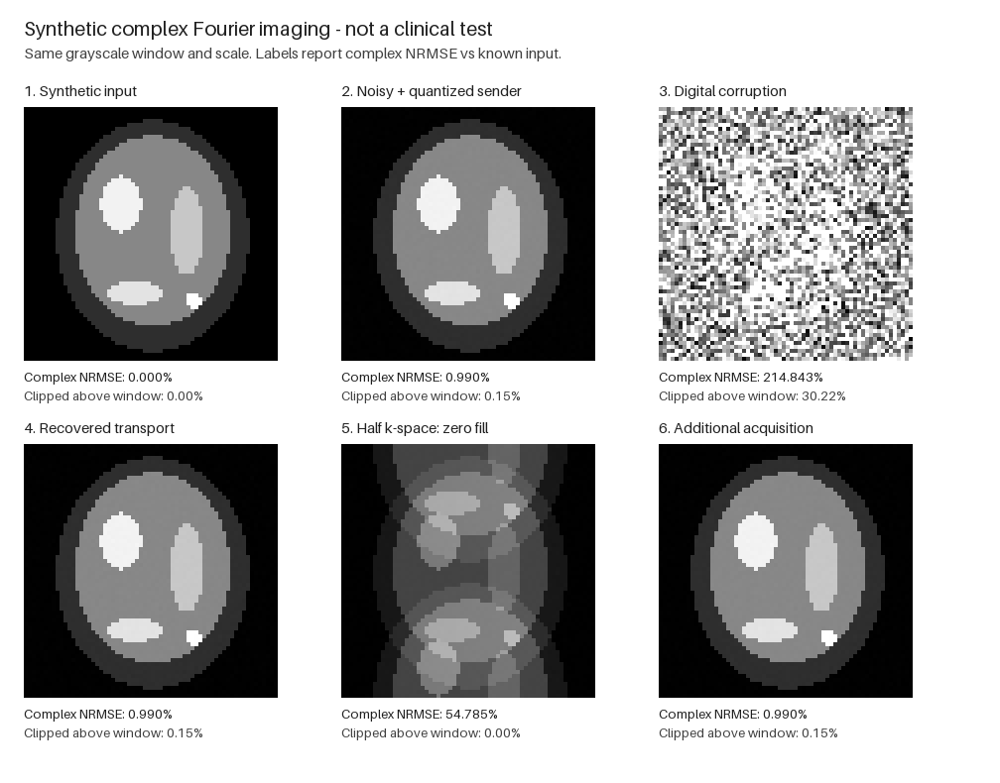

# MRI: test od k-space do zrekonstruowanego obrazu

**2026-09-09. Działa korekcja kontrolowanego uszkodzenia transportu cyfrowego. Nie wykazaliśmy naprawy akwizycji MRI ani przewagi klinicznej.**

To pierwszy test całego toru obrazowania w tym pakiecie, nie kolejne podstawienie do Ristego. Wcześniejsze tożsamości, modele FEC i odczyty ζ miały testy składowych; nie były testami rekonstrukcji obrazów.

**Dalszy audyt:** [porównanie RS, kontrola sumowania obrazów, dwa kanały i kalibracja cewek](MRI_REVIEW_AND_DOUBLE_COVER.md). Ten dokument zachowuje wyniki pierwotnej metody; nowy raport nie przepisuje ich jako wyniku RS.

## Co uruchomiono

Znany syntetyczny obraz zespolony 64×64 → unitarna FFT → zespolony szum Gaussa o zadanym energetycznym SNR 40 dB → **jedna** kwantyzacja Re/Im do int16 → ramki i referencje → kontrolowane uszkodzenia bajtów → korekcja → odwrotna FFT.

Obraz złożony z elips ma znaną amplitudę i fazę. Jest to idealizowany model pojedynczej cewki o stałej czułości, bez modelu spinów, sekwencji impulsów, ruchu, niejednorodności pola czy geometrii rzeczywistego pacjenta. Jednostki amplitudy są arbitralne.

- 20 prób, ziarna 20260909–20260928, ten sam fantom, niezależne realizacje szumu i uszkodzeń.
- 4096 próbek zespolonych, 16 384 bajty na obraz, 64 ramki po 256 bajtów.
- Dokładnie jeden losowo zmieniony bajt na każdą ramkę: 64 uszkodzenia na obraz, 0,390625% bajtów. To **zadany test obciążeniowy**, nie oszacowanie częstości awarii skanerów.
- Referencje powstają **po** akwizycji i kwantyzacji, **przed** uszkodzeniem transportu. Odbiorca nie otrzymuje czystego obrazu ani oryginalnego payloadu.
- Nagłówek, kolejność ramek i **wszystkie bajty c₀, c₁ oraz SHA-256** zakładamy chronione. W prototypie referencje są nieuszkadzanymi obiektami w pamięci, nie zaimplementowanym bezpiecznym łączem. Ich rzeczywista ochrona wymaga osobnego projektu.

## Wyniki

NRMSE zespolone = ‖rekonstrukcja − obraz wzorcowy‖₂ / ‖obraz wzorcowy‖₂. Nie jest to procent błędnych pikseli; może przekraczać 100%. Poniżej jedna z góry wskazana próba, seed 20260909.

| Wariant | NRMSE względem obrazu wzorcowego | Co się stało |
|---|---:|---|
| Nadawca: szum + kwantyzacja | 0,9902% | Punkt odniesienia transportu |
| Uszkodzone bajty bez korekcji | 214,8429% | Sztucznie wstrzyknięte błędy transportu |
| Po korekcji | 0,9902% | Dokładnie te same bajty co u nadawcy |
| Brak połowy wierszy k-space, dopełnienie zerami | 54,7854% | Niedopróbkowanie pozostaje |
| Z dodatkowymi, wcześniej brakującymi pomiarami | 0,9902% | Pełne dane dzięki dodatkowej akwizycji |

**20/20 odzyskanych payloadów było identycznych bajtowo; poprawiono 1280/1280 uszkodzonych ramek.** Średnia NRMSE spadła z 211,1074% po uszkodzeniu transportu do 1,0006% po korekcji, dokładnie poziomu zaszumionego nadawcy. Zakres po korekcji: 0,9842–1,0253%. Szum i błąd kwantyzacji **nie zostały usunięte**.

To kontrola implementacji przewidzianej gwarancji dla jednej zmiany na ramkę, nie estymacja odporności rzeczywistego łącza z 20 sukcesów. Duża NRMSE nie oznacza wzmocnienia przez FFT: unitarność zachowuje energię błędu. Zmiana starszego bajtu int16 może mocno zmienić mały współczynnik; odwrotna FFT rozprowadza ten błąd po obrazie. Za wielkość odpowiadają format, skala i wstrzyknięta zmiana, nie dodatkowe wzmocnienie Fouriera.

Ostatni wariant nie jest algorytmem odgadującym brakujące próbki. Symulator udostępnia dodatkowe 2048 próbek tego samego nieruchomego obiektu. Bez nich lub dodatkowych, uzasadnionych ograniczeń nie ma jednoznacznej rekonstrukcji dowolnego obrazu zespolonego.



Podgląd pokazuje moduł, a podpisy podają błąd zespolony. Wszystkie obrazy mają wspólny zakres szarości [0, maksimum wzorca], bez niezależnego poprawiania kontrastu. Piksele powiększono najbliższym sąsiadem; udział wartości ponad zakresem jest jawny. Tablice zespolone zachowano osobno, bez tej wizualnej saturacji.

## Co konkretnie robi ζ

W obu odczytach używamy konwencji skończonej sumy \(\zeta_M(s)=\sum_{\lambda>0}\lambda^{-s}\), z krotnościami. W tym benchmarku s przyjmuje wartości −1, 0 i 1; nie ma tu analitycznego przedłużania.

### 1. Dwa odczyty danych: korekcja pojedynczego bajtu

Dla bajtów xᵢ definiujemy dodatnie operatory diagonalne:

\[
A_0=\operatorname{diag}(x_i+1),\qquad
A_1=\operatorname{diag}(i(x_i+1)),\qquad i=1,\ldots,256.
\]

\[
c_0=\zeta_{A_0}(-1)=\sum_i(x_i+1),\qquad
c_1=\zeta_{A_1}(-1)=\sum_i i(x_i+1).
\]

Przy jednej zmianie o wartość e na pozycji j różnice względem chronionych referencji wynoszą Δc₀=e i Δc₁=je. Stąd j=Δc₁/Δc₀, a błędny bajt można poprawić. **Wyłącznie przy założeniu co najwyżej jednej zmiany** zerowa różnica sumy oznacza brak zmiany. Przy wielu zmianach może dochodzić do kompensacji.

**To ten sam algorytm co dwie pozycyjne sumy kontrolne.** Użycie nazwy spektralnej ζ nie dodaje informacji ani nie wykazuje przewagi obliczeniowej. Nie obliczamy zety Riemanna, jej zer ani przedłużenia analitycznego.

Istnieją kolizje: `(2,2,2,2)` oraz `(3,0,3,2)` mają oba odczyty równe. Dwa uszkodzenia mogą też udawać jedno. Dlatego osobny SHA-256 wiąże kandydat z numerem i długością ramki; kontrolowane kolizje i błędne korekcje zostają odrzucone. Odrzucona ramka blokuje wydanie obrazu z danego pakietu. Hash nie jest uwierzytelnieniem ani matematycznym dowodem braku kolizji.

Pierwsza kolizja zmienia trzy pozycje: +1, −2, +1 daje oba syndromy zerowe. Inny przypadek: zmiany +1 na pozycjach 1 i 3 dają (2,4), jak pojedyncza zmiana +2 na pozycji 2. Dwie niezerowe zmiany na różnych pozycjach nie mogą dać **obu zerowych** syndromów w tej arytmetyce, ale mogą imitować jedną zmianę. Te twierdzenia nie mówią, że skrót SHA rozróżni każdą parę danych.

**Cena tego formatu:** sumy wymagają po 3 bajty, digest 32 bajty: 38/256 = **14,84375% narzutu**, bez nagłówka, identyfikatorów i ochrony kanału referencji. To minimalny rozmiar tych konkretnych pól, **nie dolna granica problemu korekcji**. Nie porównano jej z wydajnością kodu używanego w konkretnym urządzeniu; Golay, turbo i Nordstrom–Robinson nie są tutaj zaimplementowane. Tańszy prototyp RS jest opisany w [późniejszym porównaniu](MRI_REVIEW_AND_DOUBLE_COVER.md).

Te 38 bajtów także musi być dostarczone wiarygodnie. Jeśli zewnętrzny kod chroniący referencje ma sprawność R_ref, sam ich rozmiar na łączu wynosi co najmniej ⌈38/R_ref⌉ bajtów na pełną ramkę, plus właściwe nagłówki i pozostałe koszty. Nie wliczono tego do 14,84%. Dopisywanie kolejnej niechronionej sumy nie zamyka tego założenia.

Testy wykazują **odrzucenie**, nie naprawę uszkodzonych referencji. W sprawdzonych przypadkach błędnych sum i nienaruszonego digestu fałszywy kandydat nie został wydany. Nie jest to uniwersalna gwarancja braku kolizji SHA. Przy spójnej podmianie danych **i** wszystkich referencji pakiet może przejść — potrzebna jest niezależna granica zaufania. To inny przypadek niż dwie zmiany danych przy poprawnych referencjach.

### 2. Odczyt operatora pomiaru: czego nie da się zobaczyć

Dla dowolnego **skończonego** operatora liniowego E: ℂⁿ→ℂᵐ, przy H=E*E i pominiętych zerowych wartościach własnych:

\[
H=E^*E,\qquad
\zeta_H(s)=\sum_{\lambda>0}\lambda^{-s},\qquad
\boxed{\dim\ker E=n-\zeta_H(0)}.
\]

Dowód: x*Hx=‖Ex‖², więc ker H=ker E; ponadto ζ_H(0) liczy dodatnie wartości własne z krotnościami, czyli rank H=rank E. **Założenie, że H jest projekcją, nie jest potrzebne.** Wymiar niepustego włókna E⁻¹(y) wynosi n−rank E, a nie rank E.

W tych dwóch odczytach zapis spektralny oznacza zwykłe **ślady** ζ_A(−1)=tr A i **rząd** ζ_H(0)=rank H. Natomiast ζ_H(1)=tr H⁺ zależy także od wielkości dodatnich wartości własnych — nie redukuje się ogólnie do rzędu. Nie przenosimy tego rachunku na ζ-regularyzację operatora o nieskończonym widmie.

**Szczególny przypadek benchmarku:** E=PF, F jest unitarna, P wybiera różne próbki. Tylko tutaj H jest projekcją z widmem 0/1, co uzasadnia skrót obliczeniowy `sampling_summary`. Przy znanym n=4096:

| Akwizycja | ζ_H(0) | Wymiar jądra nad ℂ |
|---|---:|---:|
| Wszystkie próbki | 4096 | 0 |
| Co drugi wiersz k-space | 2048 | 2048 |
| Po dodaniu pozostałych pomiarów | 4096 | 0 |

Wynik analityczny sprawdzono niezależnie na jawnej macierzy Fouriera 8×8 i wartościach własnych E*E. Kontrola negatywna konstruuje dwa obrazy różniące się o 25% NRMSE, których **zmierzone próbki są identyczne** przy połowie maski. ζ zna wymiar brakujących kierunków, nie ich wartości.

Precyzja po recenzji GLM: **znany E pozwala wyznaczyć kierunki jądra**, np. dla E=PF są to odwrotne transformaty pominiętych modów. Niewyznaczone przez pomiary pozostają współczynniki obrazu w tych kierunkach. Same skalarne odczyty ζ nie wyznaczają kierunków: diag(1,0) i diag(0,1) mają tę samą ζ, a różne jądra.

Dodano również operatory prostokątne zespolone i nieprojekcyjny H=diag(4,1/4,0): ζ_H(0)=2, dim ker E=1, ζ_H(1)=4,25. W obliczeniach próg 10⁻¹⁰ daje **rząd numeryczny**: dodatnia wartość 10⁻¹² może zostać pominięta. Kod nie certyfikuje jej dokładnego zerowania.

Ponadto uszkodzenie wartości próbek nie zmienia samego E: ζ_H jest identyczna przed i po takim uszkodzeniu. Ten odczyt nie zastępuje sum kontrolnych. Pełny rząd także nie wystarcza do stabilności: dla H=diag(1,1,10⁻⁴) jądro jest zerowe, ale ζ_H(1)=10002 zamiast 3. To kontrola uwarunkowania, przy zadanym skalowaniu i progu numerycznym, nie uniwersalny próg jakości MRI.

## Testy i odtwarzanie

**34/34 testy przeszły** po uwagach Kimi (wcześniej 26): wyczerpujące 65 280 kombinacji jednej zmiany bajtu w 256-bajtowej ramce; 9690 pojedynczych zmian bajtów referencji, wszystkie odrzucone; 20 pełnych prób obrazowania; kolizje i błędne korekcje; podmiana referencji; operatory nieprojekcyjne; próg rzędu numerycznego. Historyczne wyniki 20 prób obrazowania pozostają niezmienione.

- [Skrypt eksperymentu](mri_transport_benchmark.py)
- [Testy](test_mri_transport_benchmark.py)
- [Wyniki wszystkich prób](mri_benchmark/results.json)
- [Tablice zespolone do niezależnego odtworzenia](mri_benchmark/primary_arrays.npz)

Python 3.12.14, NumPy 2.3.5; Pillow 12.3.0 tylko do eksportu obrazów. Ziarna i wersje są zapisane. Czasy lokalnego dekodera są diagnostyczne, zmieniają się między uruchomieniami i nie stanowią benchmarku skanera.

```sh
python3 -m unittest discover -s MRI -p 'test_mri_transport_benchmark.py' -v
python3 MRI/mri_transport_benchmark.py --seed 20260909 --size 64 --runs 20
```

Polecenia uruchamiane z katalogu głównego tego repozytorium. Można użyć innego interpretera z NumPy i Pillow; `--no-images` pomija Pillow. Ogólna, bezpakietowa seria testów pomija ten moduł, jeśli NumPy nie jest dostępne, zamiast udawać jego wykonanie.

## Granica wyniku i następny krok dla MRI

Ten benchmark potwierdza połączenie **kodowania ochronnego z odwracalną rekonstrukcją Fouriera** w zadanym modelu uszkodzeń. Nie wykazuje awarii standardowych torów MRI ani nowej metody odzyskiwania fizycznie niezmierzonych danych. Aliasing nie jest przepełnieniem typu integer; zachowanie ℂ nie zwiększa samo w sobie liczby niezależnych pomiarów.

Następny test dotyczy właściwej rekonstrukcji wielocewkowej: E=[PFS₁;…;PFS_c], jawne mapy czułości, maska próbkowania, szum i celowo błędna kalibracja. Trzeba porównać błąd rekonstrukcji oraz uwarunkowanie E, nie tylko bajtową integralność. Odczyt ζ pozostaje dodatkowym pomiarem. SPIRiT wykorzystuje zgodność między cewkami i kalibrację; LORAKS wykorzystuje zadeklarowaną strukturę niskiego rzędu. Żadnego z nich ten skrypt nie implementuje ani nie pokonuje: [Lustig–Pauly, SPIRiT (2010)](https://pmc.ncbi.nlm.nih.gov/articles/PMC2925465/), [Haldar, LORAKS (2014)](https://pmc.ncbi.nlm.nih.gov/articles/PMC4122573/).

Weryfikacja na rzeczywistych, odpowiednio udostępnionych danych, porównanie z metodą bazową oraz ocena specjalisty MRI pozostają przed jakimkolwiek twierdzeniem o zastosowaniu klinicznym. Żaden skaner, pacjent, sekwencja RF ani emisja dźwięku nie zostały użyte lub zmodyfikowane.
